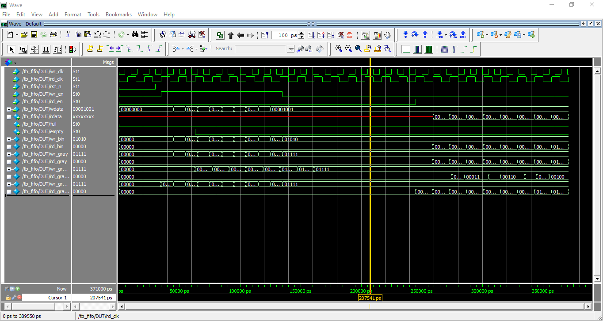
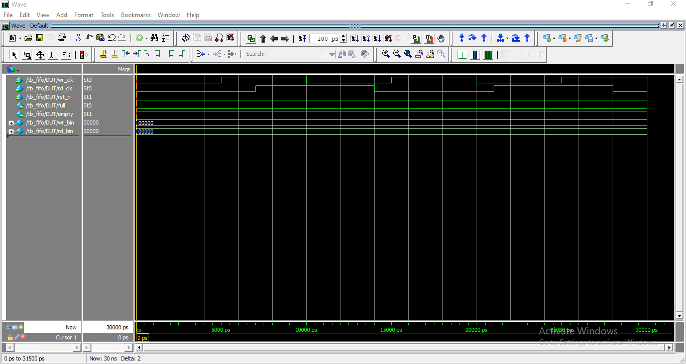
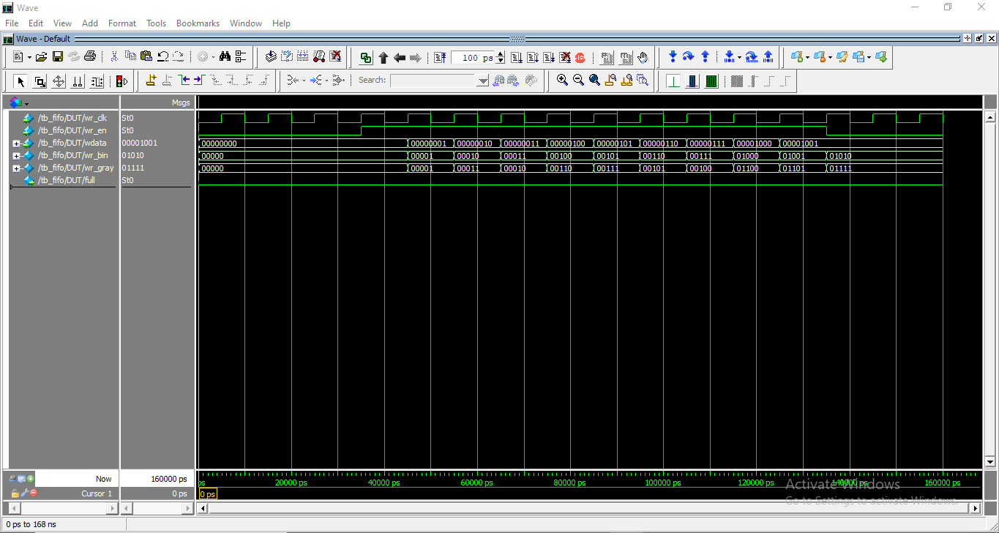
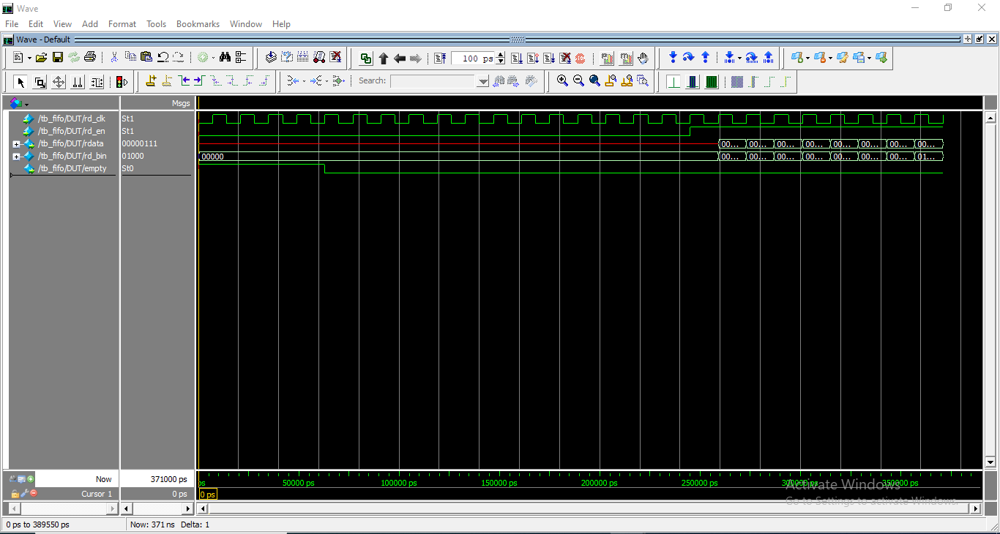
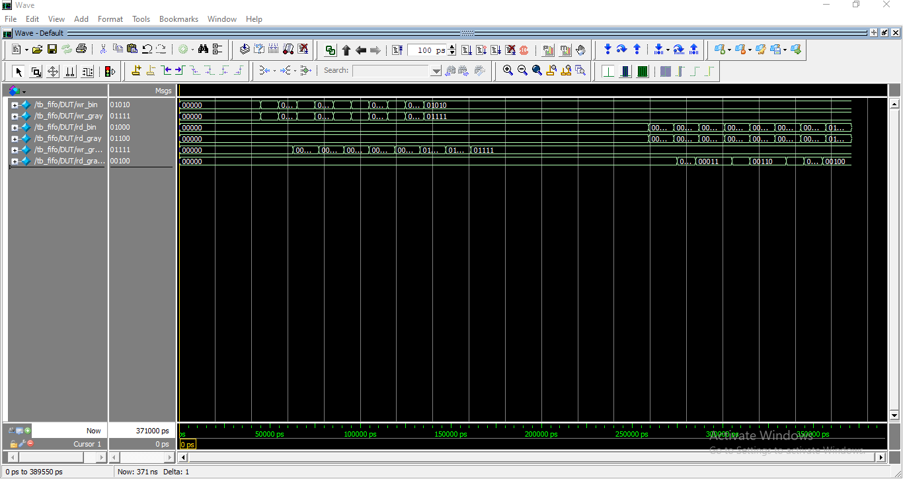
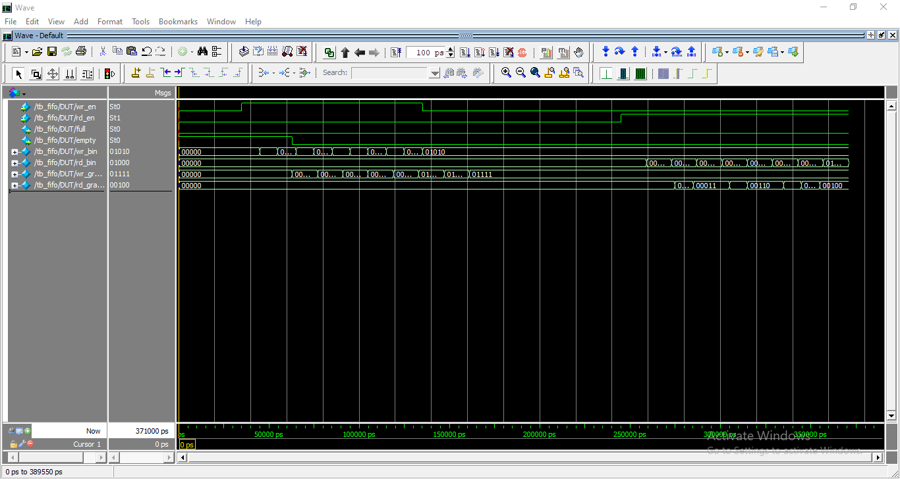

# Asynchronous FIFO Design and Verification

**Verilog | SystemVerilog | Clock Domain Crossing (CDC) | Gray Code | ModelSim**

Designed and verified a parameterized **Asynchronous FIFO** for reliable data transfer between independent clock domains using **Gray-code pointers**, **two-flop synchronizers**, and **full/empty flag generation** techniques.

---

## Skills Demonstrated

* RTL Design using Verilog HDL
* SystemVerilog Verification
* Clock Domain Crossing (CDC)
* Metastability Mitigation Techniques
* Gray-Code Synchronization
* FIFO Architecture Design
* Full and Empty Flag Generation
* ModelSim Simulation and Debugging
* Waveform Analysis and Verification Methodology

---

## Output Waveform



### Data Flow

Write Clock Domain
↓
Write Pointer
↓
FIFO Memory
↓
Read Pointer
↓
Read Clock Domain

### Additional CDC Components

* Gray Code Generator
* Two-Flop Synchronizers
* Full Flag Logic
* Empty Flag Logic

---

## Problem Statement

Modern System-on-Chip (SoC) designs consist of multiple subsystems operating at different clock frequencies. Direct communication between unrelated clock domains can lead to:

* Metastability
* Data corruption
* Data loss
* Timing violations

An **Asynchronous FIFO** is a widely adopted Clock Domain Crossing (CDC) technique that safely transfers data between independent clock domains while maintaining data integrity and system reliability.

---

## Features

* Independent write and read clock domains
* Parameterized FIFO depth and data width
* Binary and Gray-code pointer implementation
* Two-stage synchronizers for CDC
* Full flag generation
* Empty flag generation
* Asynchronous reset support
* Functional verification using ModelSim
* Waveform-based debugging and analysis

---

## RTL Modules

```text
RTL/
├── fifo_top.v
├── fifo_memory.v
├── write_pointer.v
├── read_pointer.v
├── gray_counter.v
├── synchronizer.v
├── full_flag.v
└── empty_flag.v
```

---

## Verification Environment

```text
Verification/
└── tb_fifo.v
```

---

## Verification Results

| Test Case                   | Result |
| --------------------------- | ------ |
| Reset Operation             | PASS   |
| Write Operation             | PASS   |
| Read Operation              | PASS   |
| Simultaneous Read and Write | PASS   |
| FIFO Full Condition         | PASS   |
| FIFO Empty Condition        | PASS   |
| Faster Write Clock          | PASS   |
| Faster Read Clock           | PASS   |
| Random Stress Testing       | PASS   |

---

## Simulation Results

### Reset Operation



---

### Write Operation



---

### Read Operation



---

### Gray Pointer Synchronization



---

### Full and Empty Flag Generation



---

## Clock Domain Crossing (CDC) Implementation

The asynchronous FIFO uses Gray-code pointers and two-flop synchronizers to safely transfer pointer information between unrelated clock domains.

### CDC Flow

Binary Pointer
↓
Gray Code Conversion
↓
Two-Flop Synchronizer
↓
Remote Clock Domain
↓
Full/Empty Flag Logic

### Why Gray Code?

Gray code changes only one bit between successive values, significantly reducing synchronization errors and minimizing the probability of metastability.

---

## Project Structure

```text
Async_FIFO_Design_Verification
│
├── README.md
├── RTL/
├── Verification/
├── Simulation/
├── Images/
├── Documentation/
└── LICENSE
```

---

## How to Run

### Compile

```tcl
vlib work
vlog RTL/*.v
vlog Verification/tb_fifo.v
```

### Simulate

```tcl
vsim -voptargs=+acc work.tb_fifo
add wave -r sim:/tb_fifo/*
run -all
```

### Why +acc?

The `+acc` option preserves internal signals during simulation and allows complete visibility of:

* wr_bin
* rd_bin
* wr_gray
* rd_gray
* wr_gray_sync
* rd_gray_sync

This greatly simplifies debugging and demonstrates internal Clock Domain Crossing behavior.

---

## Key Learnings

Through this project, I gained practical experience in:

* Asynchronous FIFO Architecture
* Clock Domain Crossing (CDC)
* Metastability Mitigation
* Gray-Code Synchronization
* RTL Design using Verilog HDL
* SystemVerilog Verification Methodology
* ModelSim Simulation and Debugging
* Waveform Analysis and Verification

---

## Applications

Asynchronous FIFOs are fundamental building blocks used in:

* DMA Controllers
* Ethernet MAC Controllers
* PCIe Controllers
* USB Interfaces
* Network-on-Chip (NoC)
* Multi-clock SoCs
* FPGA Communication Systems
* High-Speed Data Processing Systems

---

## Technologies Used

* Verilog HDL
* SystemVerilog
* ModelSim-Intel FPGA Starter Edition 10.5b
* Digital Design Concepts
* Clock Domain Crossing Techniques
* Git and GitHub

---

## Documentation

📄 [Project Report](Documentation/Asynchronous FIFO Design and Verification.pdf)

---

## Author

**Kishore Vanapalli**

Bachelor of Technology (B.Tech) in Electronics and Communication Engineering (ECE)
Pragati Engineering College

Aspiring VLSI Physical Design Engineer with a strong foundation in Digital Electronics, Verilog HDL, RTL Design, and Computer Architecture. Passionate about semiconductor design and currently building expertise in RTL-to-GDSII Physical Design flow, including Static Timing Analysis (STA), Floorplanning, Placement, Clock Tree Synthesis (CTS), Routing, and Physical Verification.

Areas of Interest:
• Physical Design (RTL-to-GDSII)
• Static Timing Analysis (STA)
• Digital VLSI Design
• RTL Design and Verification
• ASIC Backend Design
• Semiconductor Design and Verification

